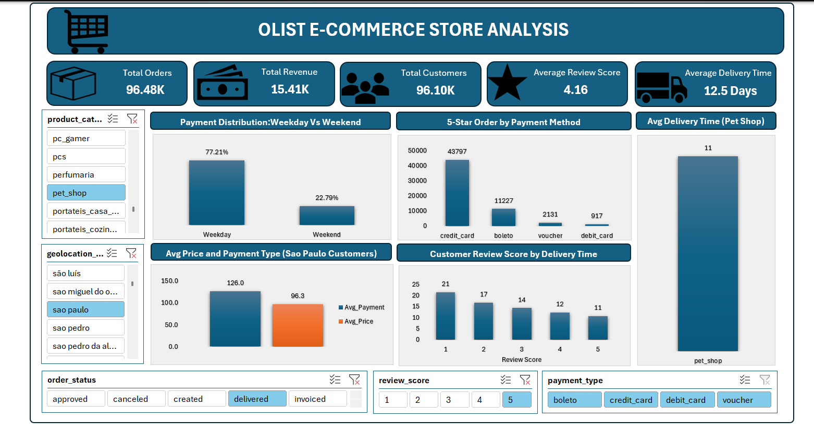
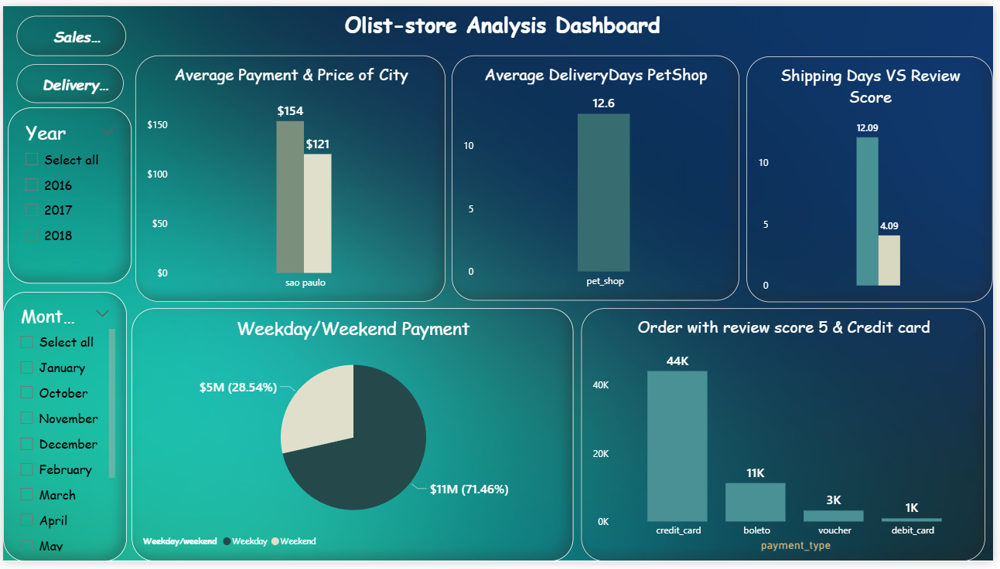
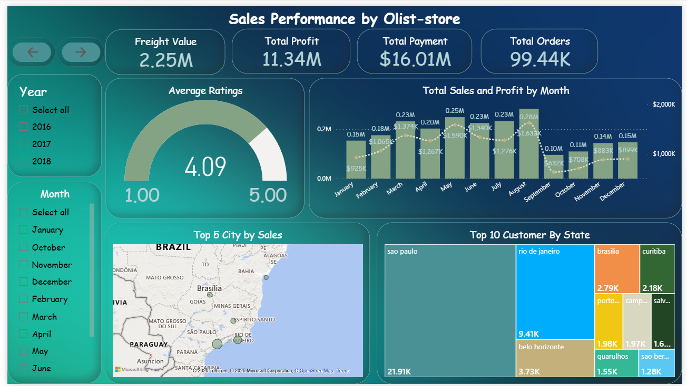
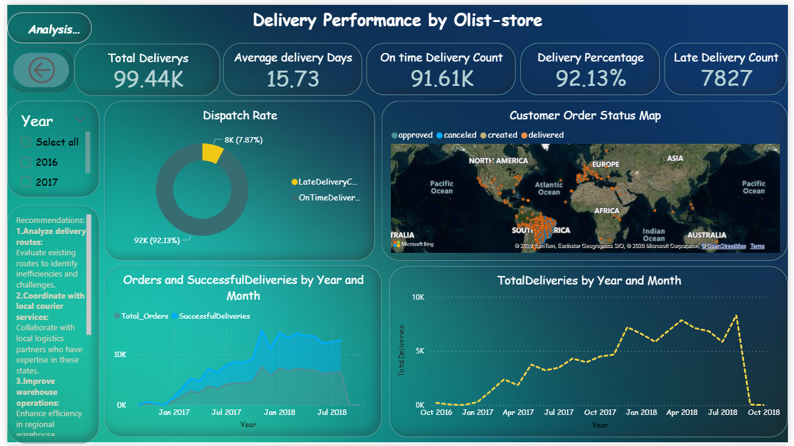
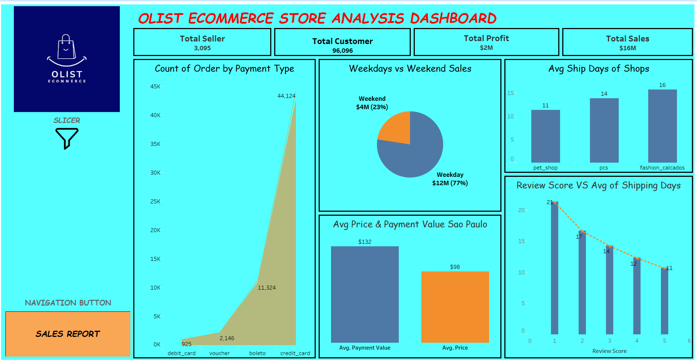
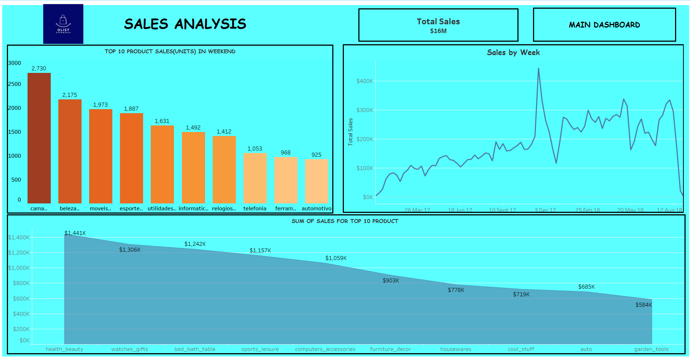

# 🛒 Olist E-Commerce Sales Analysis

## 📖 Project Overview
This project analyzes the Olist Brazilian E-Commerce dataset to uncover sales trends, customer behavior, delivery performance, payment patterns, and customer satisfaction. Using Excel, SQL, Power BI, and Tableau, raw transactional data was transformed into interactive dashbaords and actionable business insights to support data-driven business decisions.

## 🎯 Business Problem
E-Commerce businesses generate large volumes of transactional data every day. However, without proper analysis, it becomes difficult to identify sales trends, understand customer purchasing behavior, evaluate delivery performance,monitor payment preferences, and measure customer satisfaction. This project aims to analyze these business areas and provide data-driven insights than can support informed business decisions.

## 🎯 Project Objective
- Analyze sales performance and customer purchasing patterns.
- Evaluate delivery timelines and shipping performance.
- Examine customer satisfaction using review score.
- Analyze payment methods and transaction trends.
- Develop interactive dashboards using Excel, Power BI, and Tableau.
- Perform SQL-based data analysis to extract meaningful business insights.
- Support data-driven decision-making through visualization and reporting.

## 📂 Dataset
The analysis is based on the **Olist Brazilian E-Commerce Public Dataset**,which contains transactional data from a Brazilian online marketplace. The dataset includes information related to customers, orders, products, sellers, payments, reviews, and geolocation, enabling comprehensive analysis of business performance across multiple dimensions.

## 🛠️ Tools & Technologies
- **Excel**: Data cleaning, exploratory analysis, pivot tables, KPI creation, and dashboard development.
- **SQL(MySQL)**: Data extraction, transformation, and business analysis using queries.
- **Power BI**: Data modeling, DAX measures, interactive dashboards, and visualization.
- **Tableau**: Data visualization and dashboard development.
- **Power Query**: Data cleaning, transformation, and preparation before analysis.

## 🧹 Data Cleaning & Preparation
The raw Olist dataset was prepared for analysis through the following steps:
- Imported multiple CSV files and created relationships between tables.
- Cleaned and transformed data using Power Query.
- Handled missing values and inconsistent data formats.
- Created calculated columns for analysis requirements.
- Standardized data fields to improve consistency.
- Built a structured data model to support dashboard creation and analysis.

## 📊 Business Questions Answered
The analysis was designed to answer key business questions related to sales performance, customer behavior, payment trends, delivery efficiency, and customer satisfaction.

### 1. Weekday vs Weekend Payment Analysis
- Analyzed payment trends based on order purchase days to understand customer transaction behavior across weekdays and weekends.

### 2. Customer Satisfaction Analysis
- Identified orders with the highest customer satisfaction (review score of 5) and analyzed their relationship with payment methods, particularly credit card transactions.

### 3. Delivery Performance Analysis
- Evaluated average delivery time for the Pet Shop category to understand shipping efficiency and customer experience.

### 4. Customer Location & Spending Analysis
- Analyzed average order price and payment values for customers from São Paulo to understand regional purchasing patterns.

### 5. Shipping Time vs Customer Reviews
- Studied the relationship between delivery duration and customer review scores to identify the impact of shipping performance on customer satisfaction.

## 💡 Key Insights
The analysis revealed several insights related to customer behavior, sales performance, delivery efficiency, and customer satisfaction:
- Customer payment behavior showed differences between weekday and weekend transactions, helping understand purchasing patterns.
- Credit card payments represented a significant portion of successful transactions with high customer review scores.
- Delivery performance had an impact on customer satisfaction, with longer shipping times influencing review ratings.
- Customer purchasing behavior varied across locations, with São Paulo showing important sales activity.
- Delivery time analysis helped identify opportunities to improve logistics efficiency and customer experience.

## 📸 Dashboard Preview

### Excel Dashboard

View Power BI Dashboard Screenshots

 

View Tableau Dashboard Screenshots

 

## 💻 SQL Analysis

View SQL Queries

 
  
[📄 Olist SQL Analysis](sql/Olist_Sales_Analysis.sql)

## 📈 Business Recommendations
Based on the analysis, the following recommendations can help improve e-commerce performance:
- Optimize delivery processes to reduce shipping delays and improve customer satisfaction.
- Monitor delivery performance metrics regularly to identify logistics improvement areas.
- Analyze customer purchasing patterns to improve marketing and sales strategies.
- Encourage preferred payment methods while ensuring a smooth checkout experience.
- Use customer feedback and review scores to identify opportunities for service improvement.

